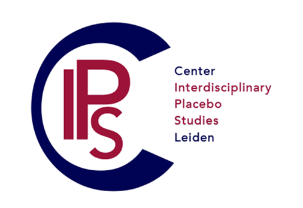

On April 13, 2023 we have launched Center for Interdisciplinary Placebo Studies Leiden (IPS). 

IPS aims to advance the understanding of placebo and nocebo effects, their underlying mechanisms, and their potential applications in clinical practice. IPS consists of a group of interdisciplinary researchers working at Leiden University with the goal to study placebo and nocebo effects in various contexts, develop training and education in the area of placebo effects, and finding ways to successfully apply this knowledge to clinical practice. 

[See our promotional video here](<https://www.youtube.com/watch?v=Z2x5odvtTk4>)

